<!--meta name="viewport" content="width=2160px"--> 
<!-- 设置固定宽度为1024px或你希望的桌面宽度 -->

[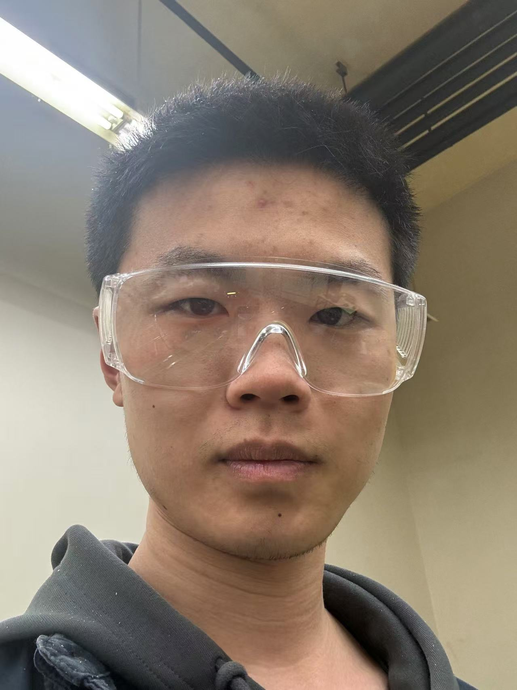](https://zhouhaozhang.github.io)

# Zhouhao Zhang

## 👋 About Me
My name is Zhouhao Zhang, I'm currently a research intern at [Zhipu AI](https://www.zhipuai.cn/en/) X-lab, guided by [Dr. Tong Yang](https://scholar.google.com/citations?user=gxdjxrwAAAAJ&hl=en&oi=ao). We are focusing on embodied-AI research.
Before that, I got my Bachelor's degree in Automation at [Beihang University](https://ev.buaa.edu.cn). During which, I got the highest scholarship of undergraduate student in China, the National Scholarship, and the third place in China University Robot Competition(ROBOCON).

This webpage showcases a selection of projects I undertook before. Most of them were completed independently, driven by my own curiosity and enthusiasm. They span a wide range of subjects, including 3D computer vision, traditional image processing, deep learning, intelligent algorithms,robotics and SLAM.

These experiences have significantly enriched my academic journey and helped me identify my passions. I firmly believe that this valuable practical experience will greatly assist me in my future scientific research endeavors.

## 🏅 My Awards
*Click on the title to view the certificate*
* **<a href="./CV.pdf" style="text-decoration:none; color:inherit;">National Scholarship</a>** | Top 3 out of 236, The Ministry of Education of the People's Republic of China, Dec 2022
* **First Prize, 23rd China University Robot Competition (ROBOCON)** ｜ National Third Place, Jul 2024
* **Second Prize, 23rd China University Robot Competition (RoboMaster)**, Apr 2024
* **Second Prize, 22nd China University Robot Competition (ROBOCON)**, Jul 2023
* **First Prize, 2022 Five Provinces of North China University Robot Competition**, Nov 2022
* **First Prize, 2022 Beijing University Robot Competition**, Nov 2022
* **Second Prize, China Intelligent Robot Fighting and Gaming Competition**, Mar 2023
* **Third Prize, 38th National College Physics Competition**, Dec 2021
* **Outstanding Graduate Award** | Beihang University, Jun 2024
* **CATIC Scholarship** | Total 10 Places in Beihang University, Dec 2023
* **First Prize, Scholarship in Discipline Competition** | Beihang University, Nov 2023
* **Second Prize, Scholarship in Outstanding Social Work** | Beihang University, Nov 2023
* **Outstanding Student Leader** | Beihang University, Nov 2023
* **Top Prize, Learning Excellence Scholarship** | Top 3 out of 154, Beihang University, Dec 2022
* **Outstanding Student** | Top 2 out of 154, Beihang University, Sep 2022
* **Third Prize, 32nd FengRu Cup Competition & Yuyuan Robots Competition** | Beihang University, Jun 2022

## 🧑🏻‍💻 Internship

<h3>
  Zhipu AI X-lab 
  
</h3>

* I'm focusing on embodied-AI research, specifically, I'm utilizing the capability of Large Language Models and Language Vision Models to improve the robots' scene understanding and reasoning.
  

    

      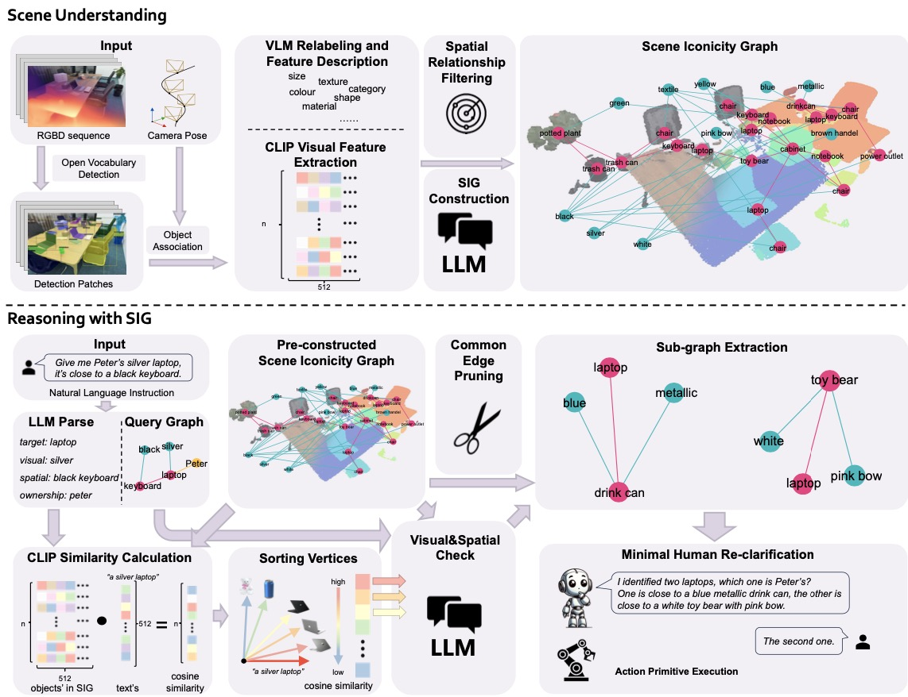
    

    

      
    

    

      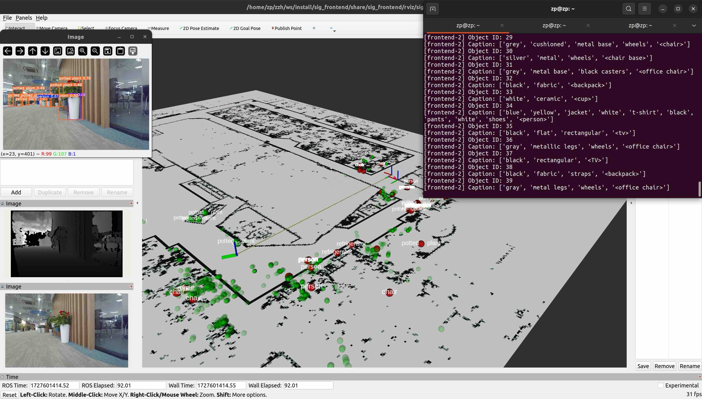
    

    

      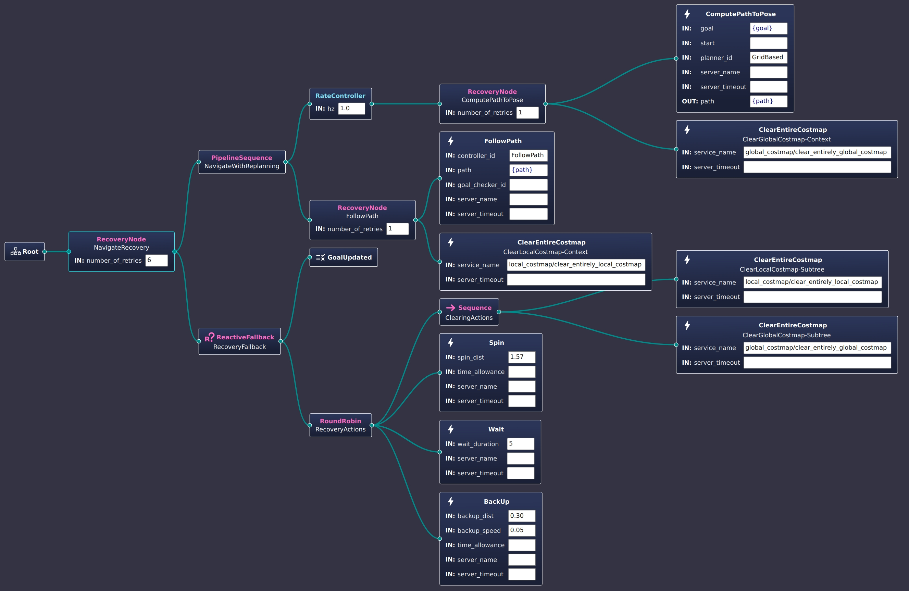
    

  

<h3>
Skyforce Technology 
</h3>

* A national invention patent is pending.
* [Auto Keystone Correction Projector with Structured Light Pair](./internship/auto%20keystone%20correction%20projector%20with%20camera/README.md): The calibration process in this study involves local homography and Gray code, while the correction process is achieved by triangulating keypoint depths and subsequently fitting the projection plane. Concurrently, an accelerometer measures the direction of gravity. The correlation between the key points on the wall and those on the projection screen is employed to compute the homography matrix, which is then used to reverse-engineer the actual display area. The primary focus of this research is to obtain the largest and sharpest inner rectangle within an arbitrary convex projected quadrilateral. In the future, an algorithm for automatically avoiding obstacles on the wall will be developed to enhance the user experience.

* [Auto Keystone Correction Projector with TOF](./internship/auto%20keystone%20correction%20projector%20with%20TOF/): Plane detection is made possible using the VL53L5CX multi-point Time-of-Flight (TOF) sensor from STMicroelectronics. Data fluctuations are minimized through a filtering process, and robustness is further improved by introducing the Random Sample Consensus (RANSAC) algorithm. The projection mechanism of ultrashort focus projectors is described using an equivalent ideal pinhole model. In other aspects, this study follows a methodology similar to previous research.

  

    

      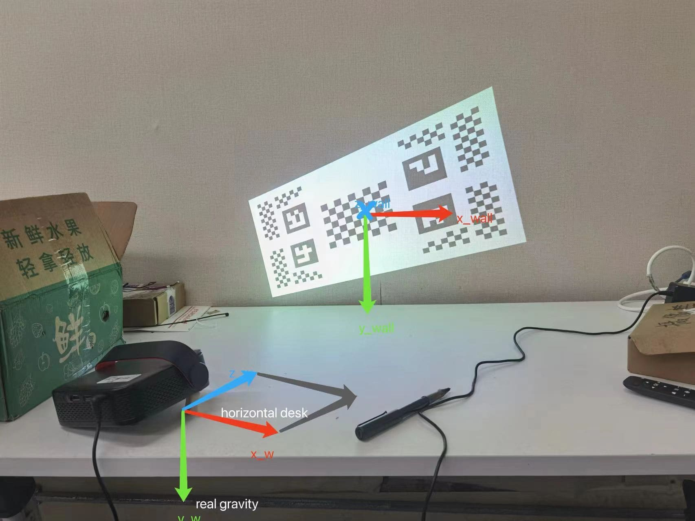
    

    

      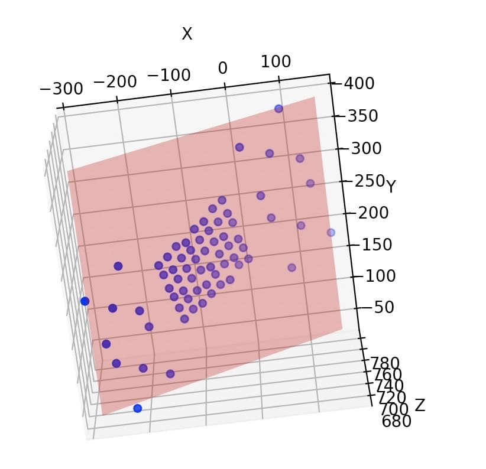
    

    

      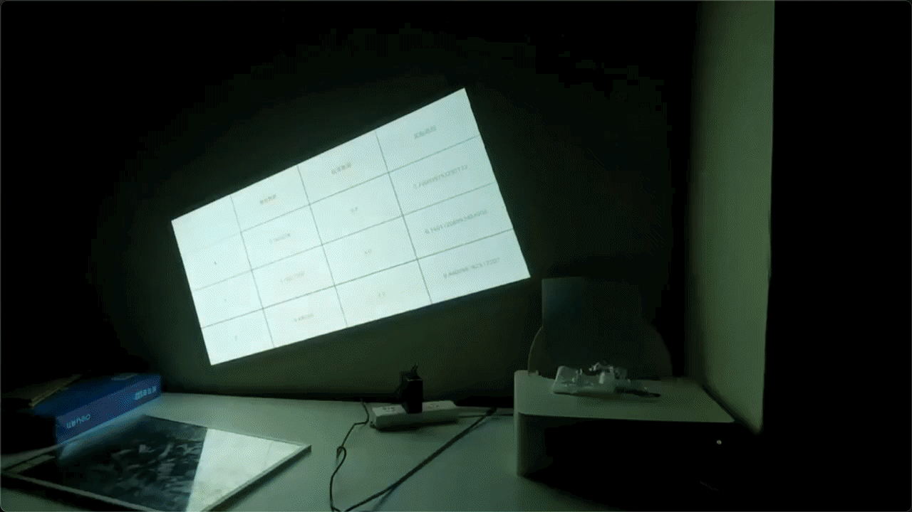
    

    

      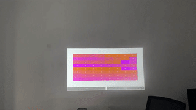
    

    

      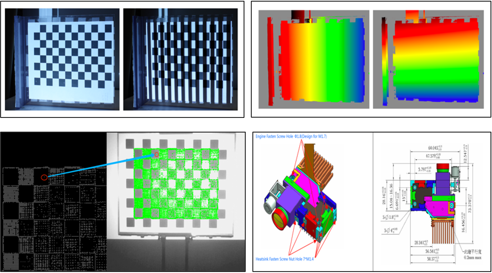
    

  

>**Praise from the project manager:**
You have refreshed my attitude towards the post-00s.
Introduce me to more students with good character like you, Zhang. I'll gather you all together as a team, you'll be the head.
    <h6>
      
    </h6>

## 🛠️ Projects

<h3>
  Beihang Robotics Team  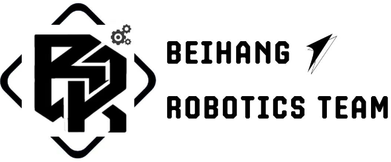 
</h3>

    <iframe src="//player.bilibili.com/player.html?isOutside=true&aid=358108413&bvid=BV1mX4y1Y7Pd&cid=1187445702&p=1" scrolling="no" border="0" frameborder="no" framespacing="0" allowfullscreen="true" style="width: 45%; aspect-ratio: 16 / 9;"></iframe>
    <iframe src="//player.bilibili.com/player.html?isOutside=true&aid=1302854537&bvid=BV1zM4m197an&cid=1495784623&p=1" scrolling="no" border="0" frameborder="no" framespacing="0" allowfullscreen="true" style="width: 45%; aspect-ratio: 16 / 9;"></iframe>
    <iframe src="//player.bilibili.com/player.html?isOutside=true&aid=112899104180386&bvid=BV1Kav9e5EfW&cid=500001637420342&p=1" scrolling="no" border="0" frameborder="no" framespacing="0" allowfullscreen="true" style="width: 45%; aspect-ratio: 16 / 9;"></iframe>
    <iframe src="//player.bilibili.com/player.html?isOutside=true&aid=1006197069&bvid=BV1qx4y1x7nz&cid=1612987246&p=1" scrolling="no" border="0" frameborder="no" framespacing="0" allowfullscreen="true" style="width: 45%; aspect-ratio: 16 / 9;"></iframe>

* [Auto-shoot Algorithm Based on Deep Learning for Racing Robot in CURC ROBOCON 2023](./robotics%20team%20of%20BUAA/ROBOCON2023/): Information for target identification and encoding is obtained through the fusion of data from laser radar, wheel odometry, and an Inertial Measurement Unit (IMU) serving as a priori localization. Target identification relies on a well-trained deep learning model with data augmentation. With the integration of localization data, precise angular deviations are computed. These deviations are subsequently sent to the motor driver chip, allowing for precise and automated shooting. Our robot's exceptional performance at the 2023 CURC ROBOCON competition served as a validation of the algorithm's precision and robustness.
    
  

    

      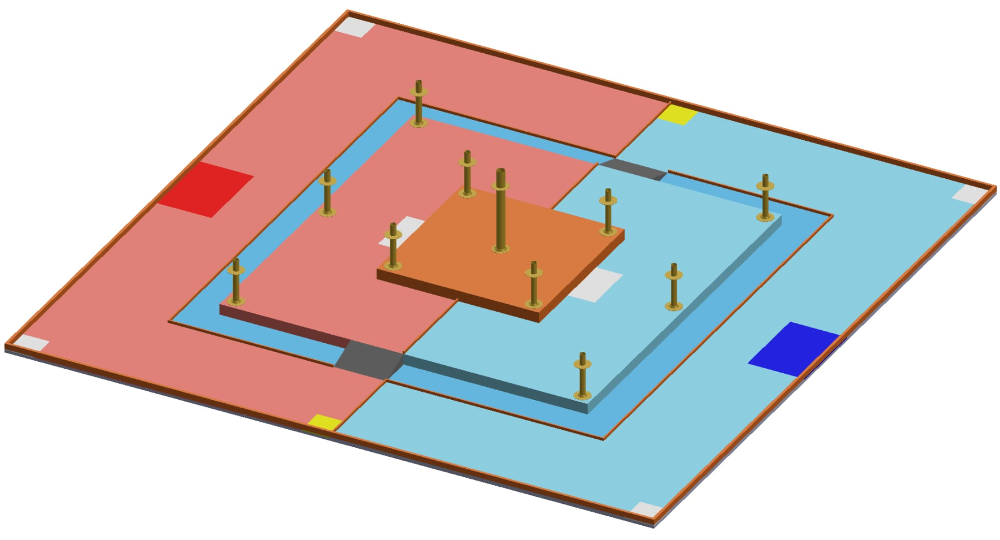
    

    

      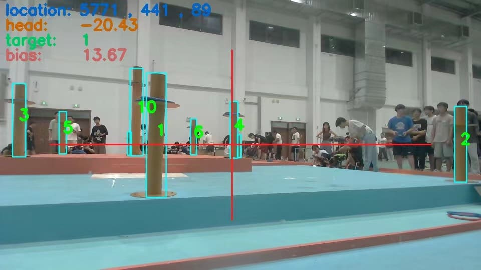
    

    

      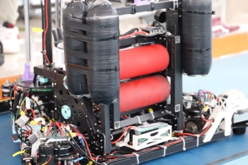
    

    

      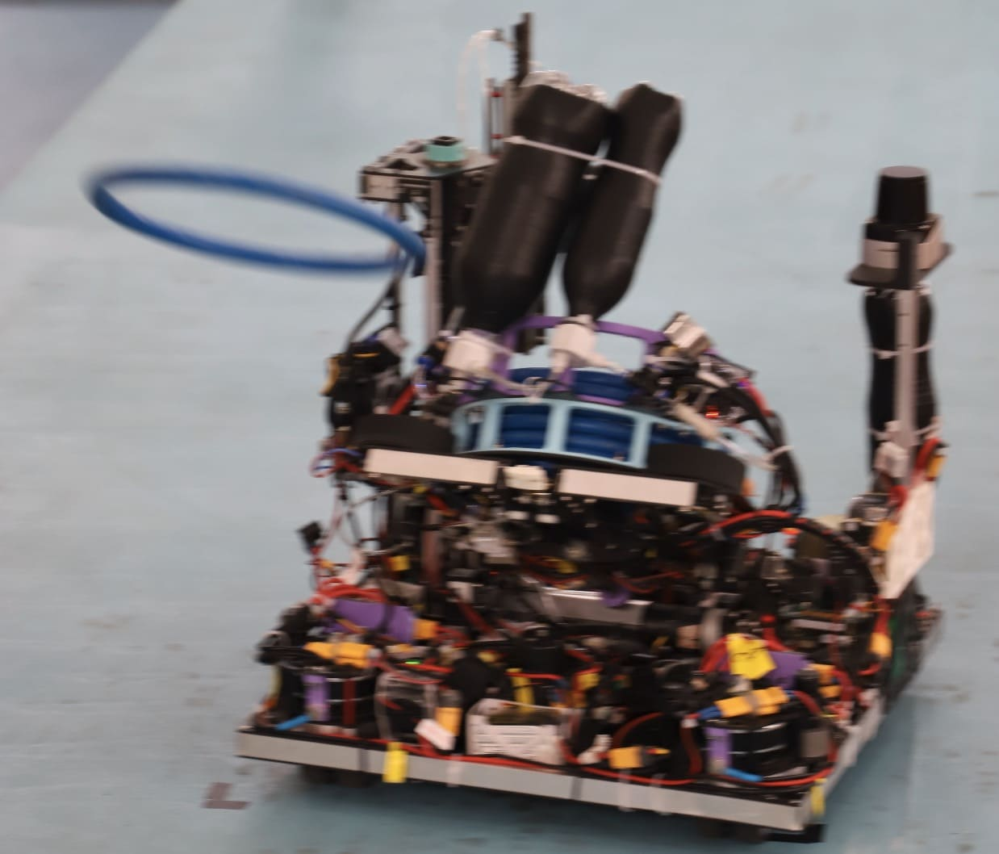
    

  

  

    

      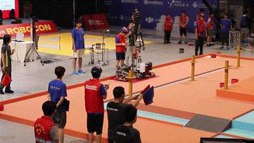
    

    

      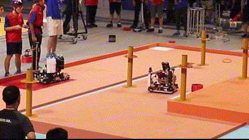
    

    

      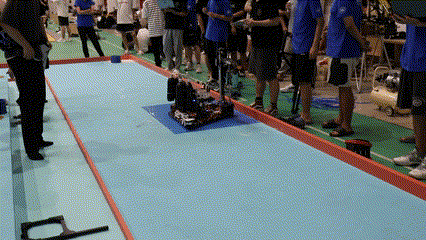
    

  

* [Decision-making algorithm for autonomous robots for ROBOCON 2024](./robotics%20team%20of%20BUAA/ROBOCON2024/): The topic for ROBOCON2024 requires autonomous robots to achieve a significant victory in Zone 3. The victory condition is to occupy three granaries. Occupying a granary is achieved when at least two of your team's balls are present in the granary, with your team's ball at the top. This places a high demand on the autonomous decision-making algorithm for robots. To address this, I have designed an algorithm based on the minimax search with alpha-beta pruning, incorporating a simulation interface. What sets this algorithm apart from traditional turn-based game tree approaches is that it allows the robot to choose to skip its own turn and wait for the opponent to act. This approach is more in line with the context of this competition and will give our autonomous robots greater flexibility.

  

    

      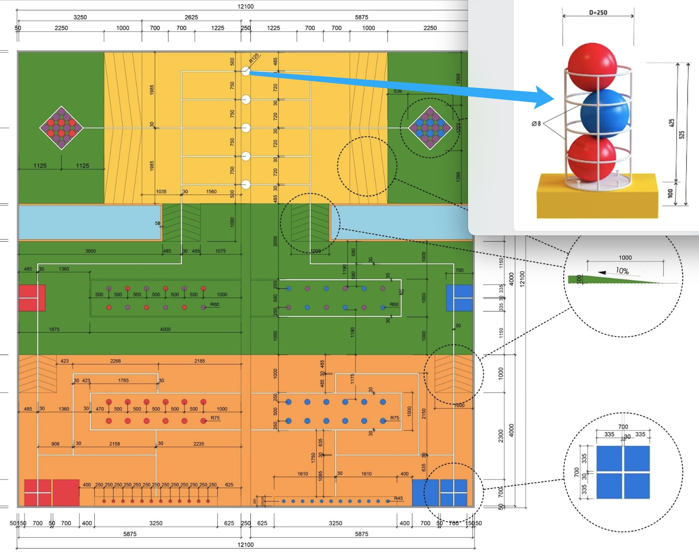
    

    

      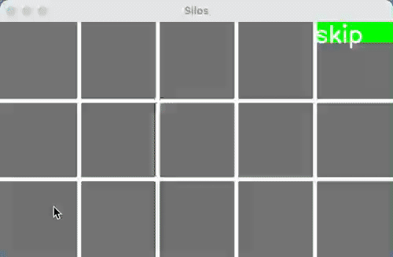
    

    

      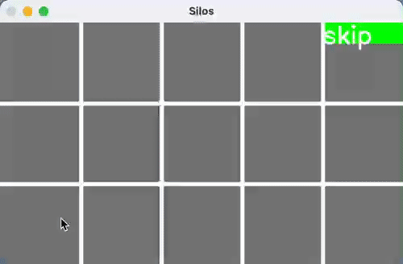
    

    

      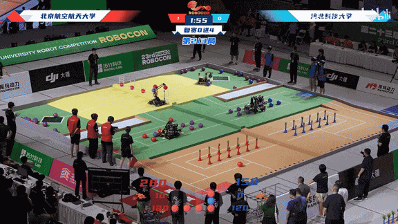
    

  

* Target trajectory analysis with stereo camera : To reduce the computational cost of the deep learning component, a sliding window is introduced, leveraging recognition results from the previous frame. The principles of triangulation are applied to calculate the three-dimensional coordinates of the target. Additionally, Kalman filtering is utilized to enhance data smoothness, predict missing identification information, and bolster overall system robustness.

  

    

      
    

    

      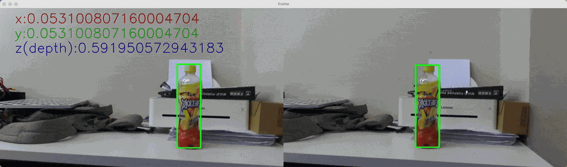
    

  

* [Team entry test](./robotics%20team%20of%20BUAA/training/README.md): Test I gave to prospective team members. It's a camera pose estimation task. In a scenario with known three-dimensional coordinates, we calculate the camera pose using the Perspective-n-Point (PNP) principle. This involves combining the corner detection results from the previous frame to establish correspondences between 2D points and 3D points. By continuously recognizing these points, we can trace and plot the camera's trajectory. I uploaded the demonstration video to the internet and received widespread attention and discussion.

  

    

      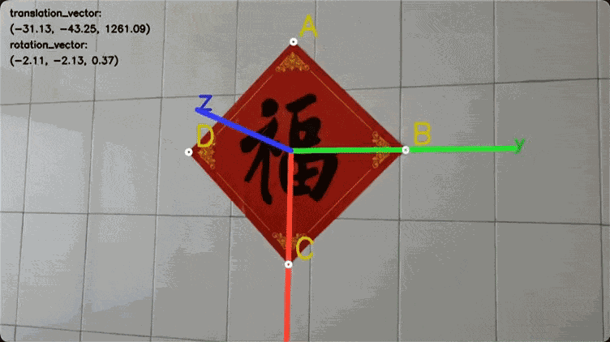
    

    

      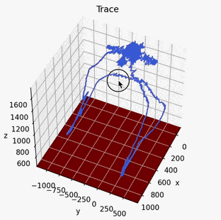
    

  

* Team trainning: This slide serves as a technical guide for new team members. It's designed to instruct newcomers on essential topics, including image processing, 3D vision, as well as providing a brief introduction to Linux and ROS.

  

    

      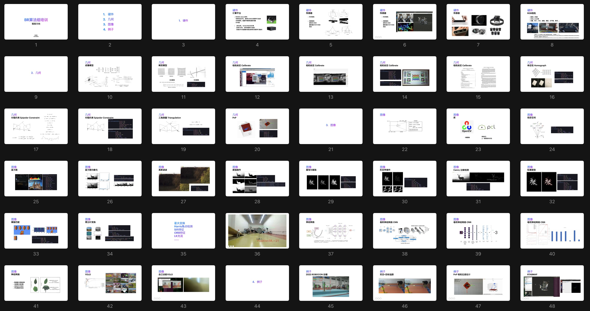
    

    

      
    

    

      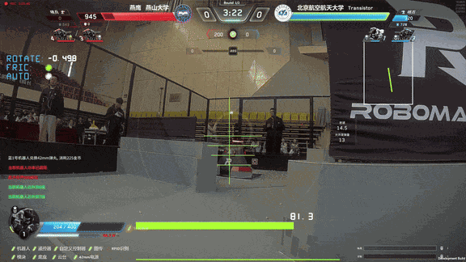
    

<h3>
  Soft Robotics Lab   
</h3>

  <iframe src="//player.bilibili.com/player.html?isOutside=true&aid=619741574&bvid=BV1g84y1d7YH&cid=1301361611&p=1" scrolling="no" border="0" frameborder="no" framespacing="0" allowfullscreen="true" style="width: 33%; aspect-ratio: 16 / 9;"></iframe>
  <iframe src="//player.bilibili.com/player.html?isOutside=true&aid=865438757&bvid=BV1a54y1u77Y&cid=1035540328&p=1" scrolling="no" border="0" frameborder="no" framespacing="0" allowfullscreen="true" style="width: 33%; aspect-ratio: 16 / 9;"></iframe>
  <iframe src="//player.bilibili.com/player.html?isOutside=true&aid=733647812&bvid=BV1hD4y1a78V&cid=921457829&p=1" scrolling="no" border="0" frameborder="no" framespacing="0" allowfullscreen="true" style="width: 33%; aspect-ratio: 16 / 9;"></iframe>

* [An Aerial–Aquatic Hitchhiking Robot with Remora-Inspired Tactile Sensors and Thrust Vectoring Units](https://onlinelibrary.wiley.com/doi/10.1002/aisy.202300381): My primary responsibilities include debugging flight control systems, providing assistance with various experiments, and working on the deployment of SLAM (Simultaneous Localization and Mapping) and automatic navigation algorithms for the next generation of robots. Our work is published in Advanced Intelligent Systems.

  

    

      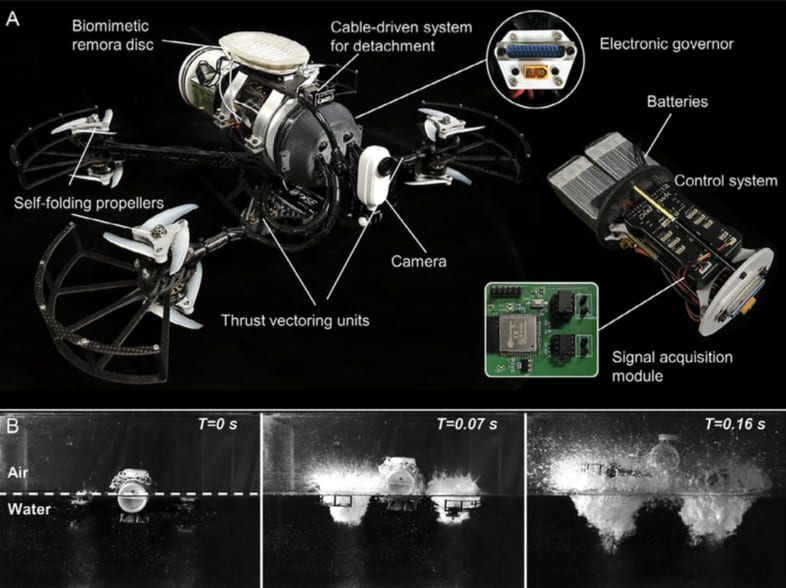
    

    

      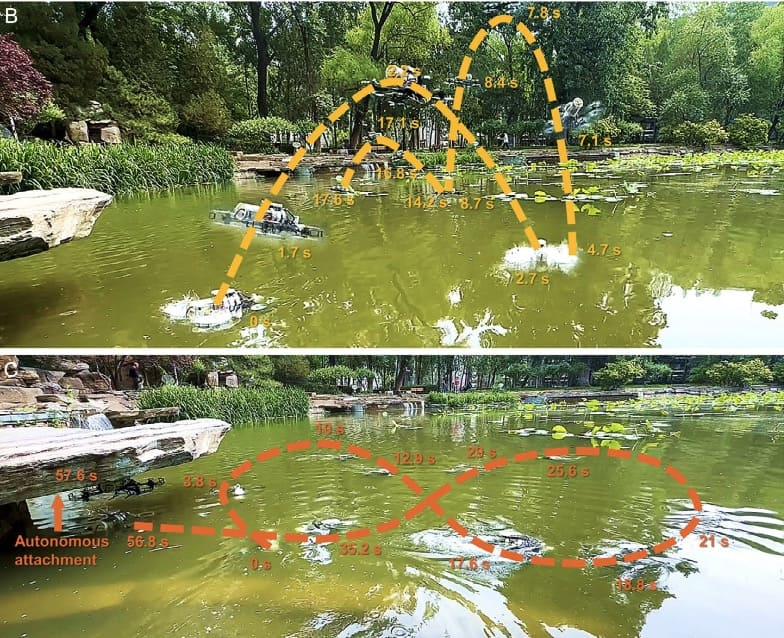
    

    

      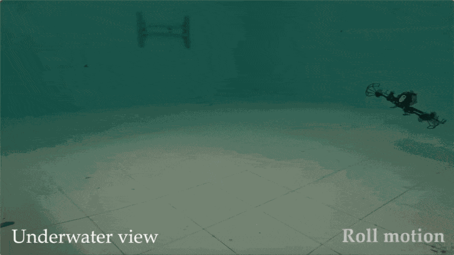
    

  

  

    

      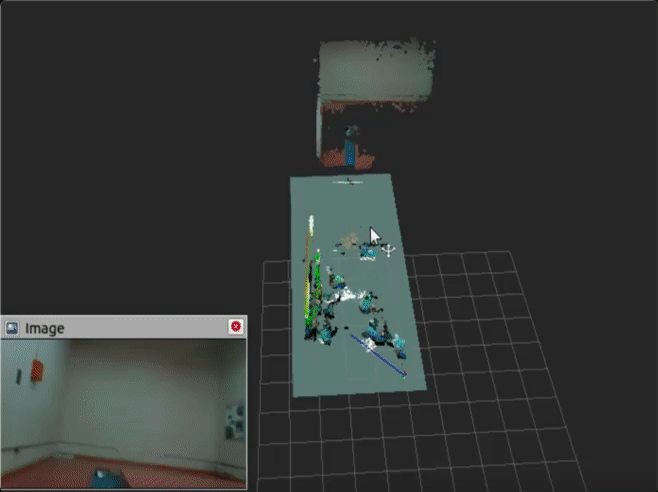
    

    

      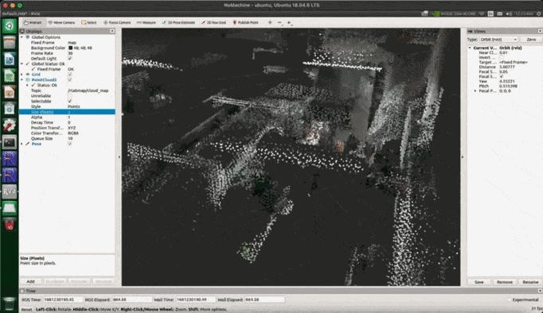
    

    

      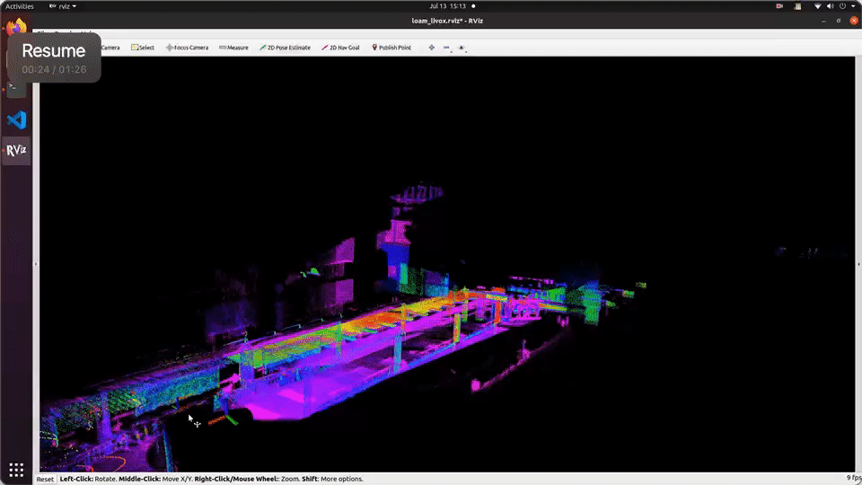
    

  

>**Praise from the doctoral students of the research group, after the first group meeting.**
Zhouhao, I think you're excellent, and you've got a rough idea of our project today. Our team members are all hardworking, and we've been striving to do some interesting and innovative research. If you're interested in this project, I'd like to invite you to join us. Let's work together and aim to publish a high-quality paper.
    <h6>
      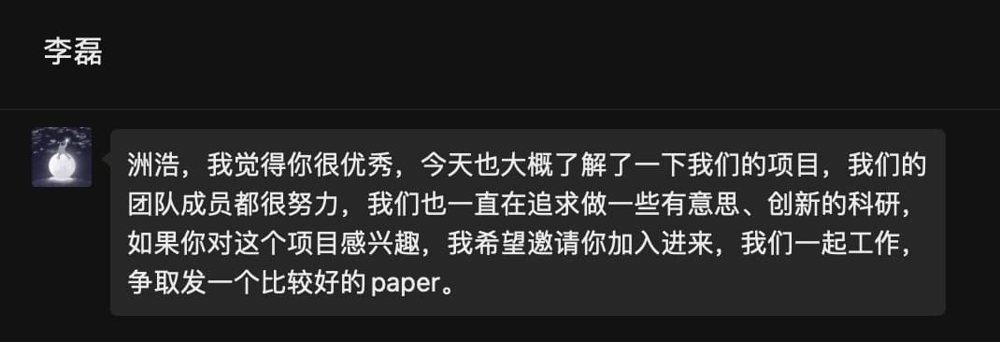
    </h6>

<h3>
  Graduation Project   
</h3>

* I finished my graduation project under the guidence of Prof. Qi Dou of CUHK.

  

    

      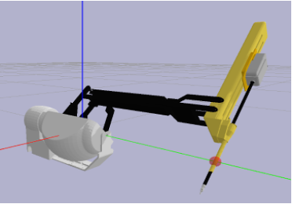
    

    

      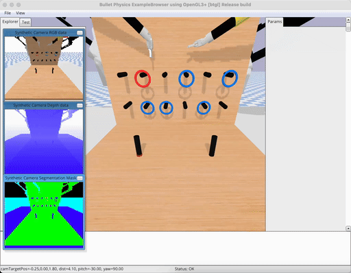
    

    

      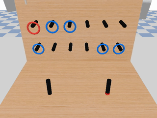
    

    

      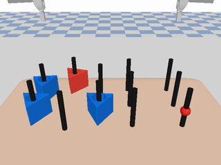
    

    

      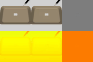
    

  

<h3>
  RedBird Challenge Camp at HKUST(GZ)   
</h3>

* It's a intelligent robot.

  

    

      
    

    

      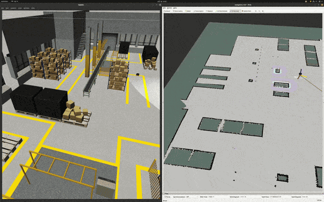
    

    

      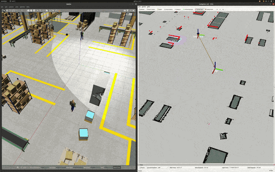
    

  

<h3>
  AI Program in NUS   
</h3>

* [Seq2Seq population forecasting model](./AI%20program%20in%20NUS/): I led the team members to apply the Seq2Seq model to the population prediction assignment, not only in the basic regression model required by the professor. We won the winning team of the NUS Artificial Intelligence and Machine Learning Summer Course, and praised by Prof. Mehual Motani.

    <h6>
      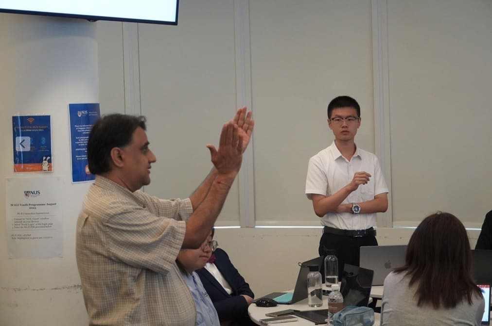
      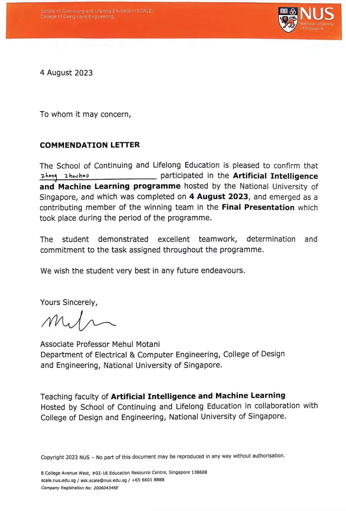
    </h6>

## 📚 Course Projects
I take every experiment in class seriously, cherish these practical opportunities, and always exceed the teacher's tasks. This seriousness is also reflected in my grades.

* PointNet/PointNet++ point cloud segmentation: I led the team to dive into the architecture of PointNet and PointNet++. Through the common BackBone with different heads, the classification and segmentation tasks of point clouds are realized. I deeply explored the properties of T-Net, and tried to change the structure of T-Net, adding residual connections and so on to obtain different performance.

  

    

      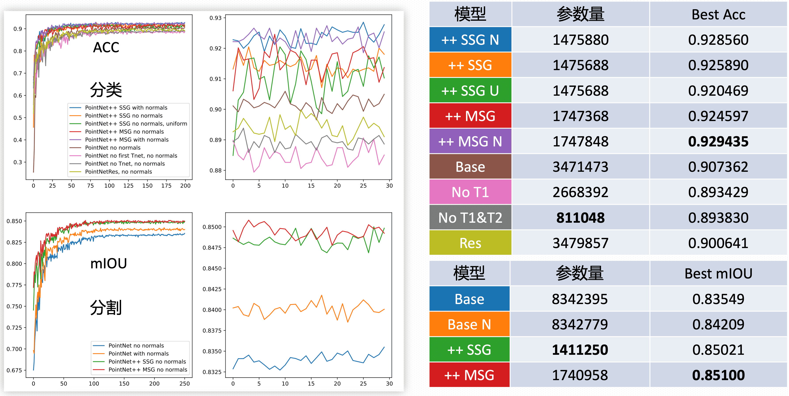
    

    

      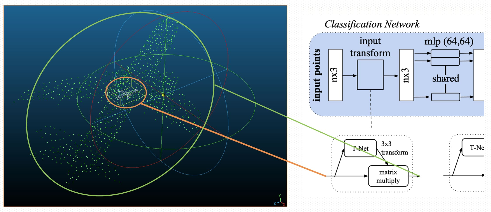
    

    

      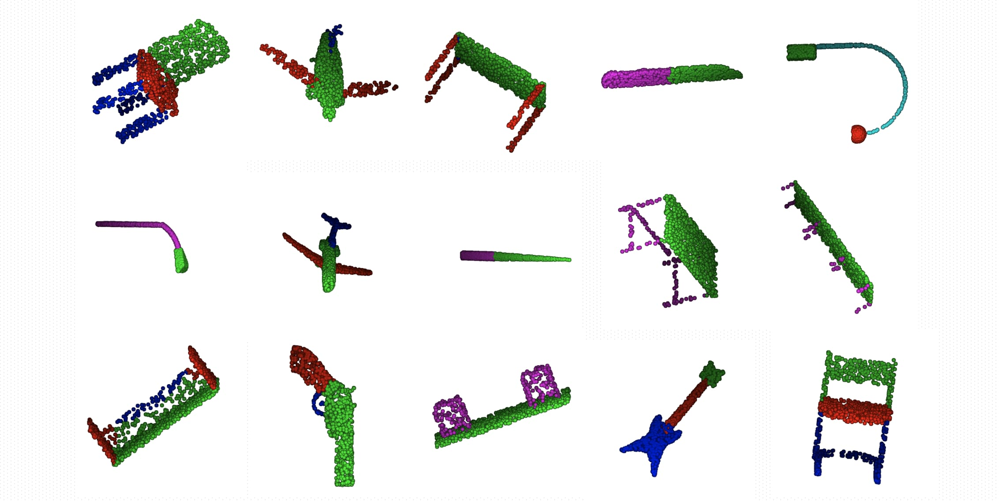
    

  

* [Experiments on Eight-Puzzle graph search algorithms](./in-class%20experiments/8dig): BFS, DFS and A* search algorithms are used to solve the eight-digit game, and the differences in search strategies and performance are explored.

<h6>
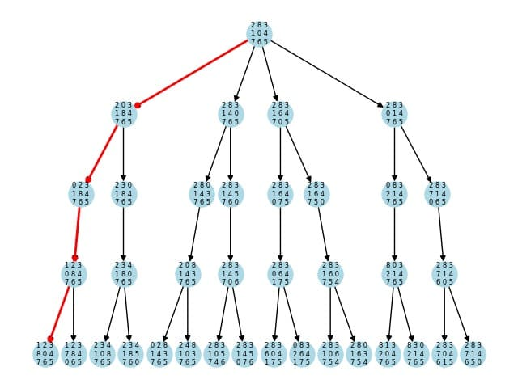
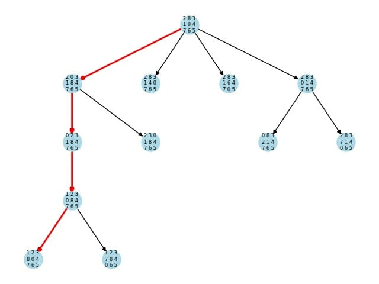
</h6>

* [Comparison experiments between CNN and Dense](./in-class%20experiments/Comparison%20experiments%20between%20CNN%20and%20Dense/README.md): I was inspired by Professor Li Mu's *Drive into Deep Learning* and personally constructed various classic neural networks for the MNIST and Fashion MNIST datasets. I compared their performance and parameter differences. To gain a better understanding of how convolutional neural networks work, I visualized the results of each layer of LeNet. Below are some illustrative figures from my experimental report.

<h6>
  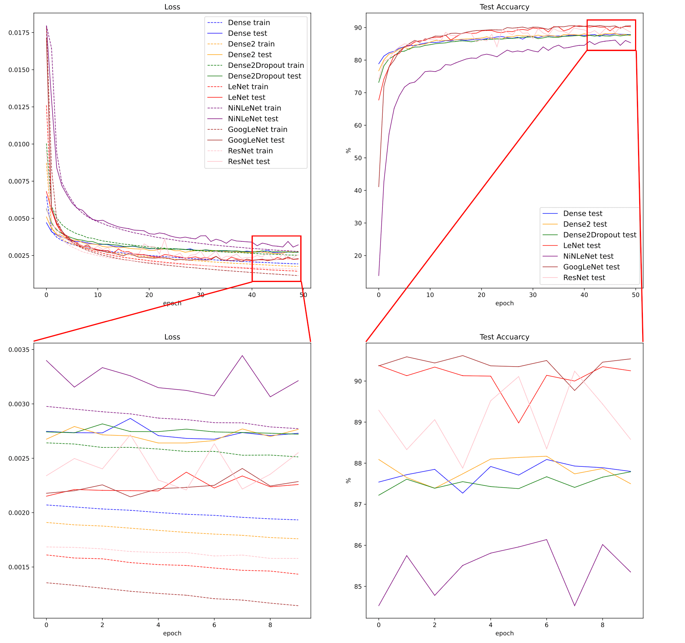
  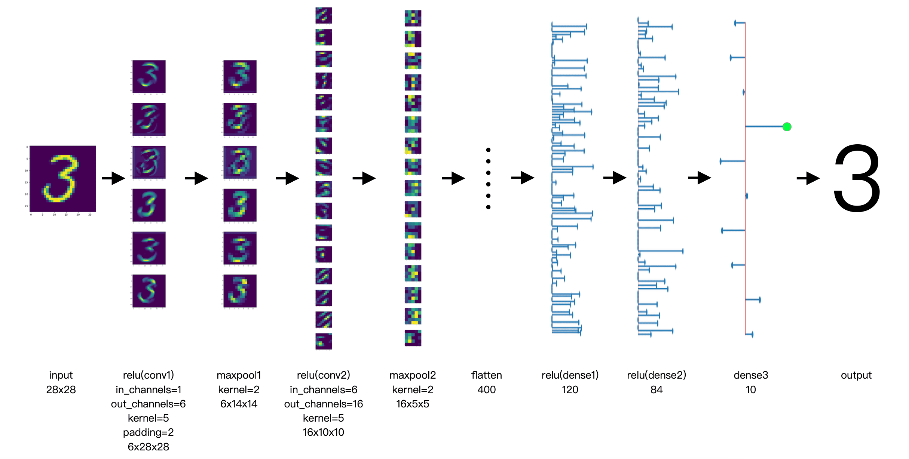
</h6>

* [Experiments on Medical Image segmentation (Liver)](./in-class%20experiments/Experiments%20on%20Medical%20Image%20segmentation/liver/README.md)

* [Experiments on Medical Image segmentation (Retinal vessels)](./in-class%20experiments/Experiments%20on%20Medical%20Image%20segmentation/Retinal%20vessels/README.md)
The above two are medical image segmentation experiments I conducted. I reproduced the classic U-Net using PyTorch and experimented with various hyperparameters to achieve good model training and convergence on a small dataset, resulting in a satisfying outcome. During liver CT segmentation, I noticed the issue of uneven distribution in the original data. After experiencing initial failures, I performed data normalization to overcome the challenge and ultimately achieved successful experimental results.

  

    

      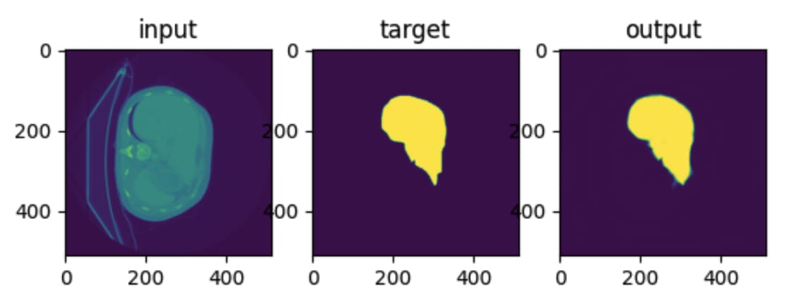
    

    

      
    

    

      
    

    

      
    

  

* [EEG-based Motor Imagery Classification](./in-class%20experiments/EEG-based%20Motor%20Imagery%20Classification/README.md): Inferring motor imagery through EEG signals has always been a challenge. I read the paper on EEGnet and implemented it using PyTorch, following its network structure. During the experiment, I gained a deep understanding of the significance of group convolution, depth-wise convolution, and point-wise convolution. In the end, my experimental results ranked at the top of the class for both binary and four-class classification tasks.
    
  

    

      
    

    

      
    

  

* [Robot path planning experiments](./in-class%20experiments/Robot%20path%20planning%20experiments/README.md) I explored the differences in various heuristic functions in robot path planning tasks and summarized my findings in an experimental report. The visual process of the experiment has been uploaded to Bilibili.
  

    <iframe src="//player.bilibili.com/player.html?isOutside=true&aid=953162139&bvid=BV1Us4y1g7rq&cid=1116087360&p=1" scrolling="no" frameborder="no" width=440 style="width: 45%; aspect-ratio: 16 / 9;"></iframe>
  

* [Recognition of handwritten Arabic characters](./in-class%20experiments/Recognition%20of%20handwritten%20Arabic%20characters/README.md)

    <h6>
      
    </h6>

* [GMM Built by EM Algorithm](./in-class%20experiments/GMM%20Built%20by%20EM%20Algorithm/)

    <h6>
      
    </h6>

## 🎞️ Gallery

* The following images were taken on medium format film.

  

    

      
    

    

      
    

    

      
    

    

      
    

    

      
    

    

      
    

    

      
    

    

      
    

    

      
    

    

      
    

  

  

